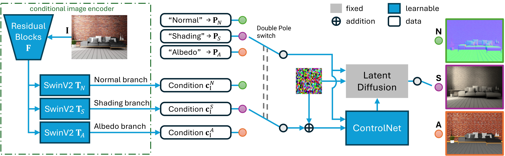

# IntrinsicDiffusion: Joint Intrinsic Layers from Latent Diffusion Models
### ***This work was partially completed during the first author’s internship at Adobe Research.***
[[project page]](https://intrinsicdiffusion.github.io/)
[[presentation]](https://www.youtube.com/watch?v=_8yy5qw8tR8)<br>
[[DOI]](https://dl.acm.org/doi/10.1145/3641519.3657472)
[[paper]](https://intrinsicdiffusion.github.io/paper/IntrinsicDiffusion.pdf) 
[[supplement doc]](https://drive.google.com/file/d/1FW4b8UqsFokhhg5X4XOu4IGp2tNVwcai/view)
[[supplement materials]](https://drive.google.com/file/d/13d123va_HIDOuLwQQBL9qfS_Zt0kOAvl/view)




Updates
-

[//]: # (+ //: Released the training code.)
+ 02/Sep/2025: Released the trained models and the inference code.


Dependencies
-
+ Python 3.8
+ PyTorch 2.0.1
+ Diffusers 0.24.0 ***(Important: other versions may not work properly.)***
+ File [tools/install.txt](tools/install.txt) for other dependencies.


Datasets
-
(coming soon)

[//]: # (+ Download:)

[//]: # (+ Split files: we back up the used split files in the ```dataset/split_files``` folder. )

[//]: # (+ Put the datasets in the ```data/``` folder. The final directory structure:)

[//]: # (+ Paths to the datasets are set in ```configs/config.py```.)


Train
-
(coming soon)

[//]: # ([Navigate to the Training Doc]&#40;docs/train/README.md&#41;)


Trained Models
-
- SD base model: [ptx0/pseudo-journey-v2](https://huggingface.co/bghira/pseudo-journey-v2) 
(Our code automatically downloads this base model.)
- Download our [trained conditioning model](https://drive.google.com/drive/folders/14x9zfiTPydC5-Yb25wGq1xBoZNOGty4o?usp=sharing). 
The directory structure should look like:
  ```
  IntrinsicDiffusion project
  |--- trained_models/
      |--- controlnet
          |--- config.json
          |--- diffusion_pytorch_model.safetensors
      |--- prompt_adapter
          |--- prompt_adapter.pt
  ```


Evaluation
- 
(coming soon)

[//]: # ([Navigate to the Evaluation Doc]&#40;docs/test/README.md&#41;)


Infer
-
#### Run Gradio GUI demo:
  ```console
    CUDA_VISIBLE_DEVICES=0 python gradio_app.py
  ```
+ `-p 7860`: specify the port number to run the server on (default: 7860).
+ `-s`: create a publicly shareable link.

#### Alternatively, run inference on images in a directory:
  ```console
    export GPU=0
    export SD_MODEL="ptx0/pseudo-journey-v2"
    export CONTROLNET_MODEL="./trained_models/controlnet"
    export PROMPT_MODEL="./trained_models/prompt_adapter"
    export OUTPUT_DIR="experiments/example_results/"
    export DATA_DIR="./examples/"

    CUDA_VISIBLE_DEVICES=${GPU} python infer.py \
      --pretrained_model_name_or_path=$SD_MODEL \
      --controlnet_model_name_or_path=$CONTROLNET_MODEL \
      --prompt_adapter_path=$PROMPT_MODEL \
      --test_data_dir=$DATA_DIR \
      --output_dir=$OUTPUT_DIR \
      --resolution="ori" \
      --output_original_size \
      --ddim_steps=20 \
      --agg_num=4 \
      --vis_wo_mask \
      #--inf_chunk_batch_size 1
  ```
+ Argument explanation:
  + <details>
      <summary>(click to expand)</summary>
    
      + Input and output directories: `--test_data_dir` and `--output_dir`.
      + `--resolution`: Resize input images. 
        + Note: Suggested to set dimensions no smaller than 512 for better performance. All input sizes are finally adjusted to multiples of 64.
        + `--resolution="ori"`: Use the original input size.
        + `--resolution=1024`: set the largest side to 1024 (keeps aspect ratio).
        + `--resolution="(512, 512)"`: resize to 512×512.
        + If not set, resizes to (max_dim, max_dim), where max_dim is the largest side of the input.
        + See `IntrinsicDiffusionPipeline.infer_intrinsic_images` in [modeling/intrinsicdiffusion_pipe.py](modeling/intrinsicdiffusion_pipe.py) for details.
      + `--output_original_size`: Resize output intrinsic images to match the original input size.
      + `--agg_num`: Number of samples to average when generating each intrinsic image.
      + `--vis_wo_mask`: Visualize intrinsic images without applying a mask.
        + If not set, a mask is applied. The mask is loaded by the class `ImageFolder`. See [dataset/dataset_imagefolder.py](dataset/dataset_imagefolder.py) for mask file naming rules.
      + Other useful options:
        + `--linear_input`: Set this if input images are already in linear space.
          + Note: All output intrinsic images are in linear space.
        + `--inf_chunk_batch_size`: True batch size for inference. If GPU memory is limited, set this to a smaller positive integer (e.g., 1 or 2).
        + `--seed`: Random seed (default: 999).
      </details>
 


Acknowledgements
-
- Test images in ```examples/``` are from the [IIW benchmark](http://opensurfaces.cs.cornell.edu/intrinsic/)
and the [Unsplash](https://unsplash.com/). (See [license details](examples/README.md))
- Code Contributions:
  + Our image conditioning encoder builds on:
    + ResNet: Taken from [taming-transformers](https://github.com/CompVis/taming-transformers) (```modeling/vqgan/```).
    + SwinV2: Based on [Swin-Transformer](https://github.com/microsoft/Swin-Transformer) (```modeling/swin_v2/```), with the wrapped version from [CRefNet](https://github.com/JundanLuo/CRefNet) ( ```modeling/crefnet/```).
  + Conditioning pipeline: Built upon [ControlNet](https://huggingface.co/blog/controlnet) and adapted from [diffusers](https://github.com/huggingface/diffusers/tree/v0.24.0) (```modeling/diffusers/```).
  + Some utility scripts from [CRefNet](https://github.com/JundanLuo/CRefNet)(```utils/```).
- We thank 
Peter Kocsis ([Intrinsic Image Diffusion for Indoor Single-view Material Estimation](https://peter-kocsis.github.io/IntrinsicImageDiffusion/)) 
for sharing their results for comparison.
- This work was partially completed during the first author’s internship at Adobe Research.

[//]: # (  + [CGIntrinsics]&#40;https://github.com/zhengqili/CGIntrinsics&#41;:)

[//]: # (    + Codes for loading data from the CGI and IIW datasets in ```dataset/cgintrinsics_dataset.py``` and ```dataset/iiw_dataset.py```.)

[//]: # (    + Codes for evaluation on the IIW benchmark in ```solver/metrics_iiw.py```. )

[//]: # (    This code is originally provided by [IIW]&#40;http://opensurfaces.cs.cornell.edu/intrinsic/#&#41;.)

[//]: # (    + Codes for evaluation on the SAW benchmark in ```solver/metrics_saw.py``` and ```solver/saw_utils.py```.)

[//]: # (    These codes are originally provided by [SAW]&#40;http://opensurfaces.cs.cornell.edu/saw/&#41;.)

[//]: # (    )

Citation
-
If you find this code useful for your research, please cite:
  ```
  @inproceedings{Luo2024IntrinsicDiffusion,
        author    = {Luo, Jundan and Ceylan, Duygu and Yoon, Jae Shin and Zhao, Nanxuan and Philip, Julien and Fr{\"u}hst{\"u}ck, Anna and Li, Wenbin and Richardt, Christian and Wang, Tuanfeng Y.},
        title     = {{IntrinsicDiffusion}: Joint Intrinsic Layers from Latent Diffusion Models},
        booktitle = {SIGGRAPH 2024 Conference Papers},
        year      = {2024},
        doi       = {10.1145/3641519.3657472},
        url       = {https://intrinsicdiffusion.github.io},
      }
  ```

Contact
-
Please contact Jundan Luo (<jundanluo22@gmail.com>) if you have any questions. 
